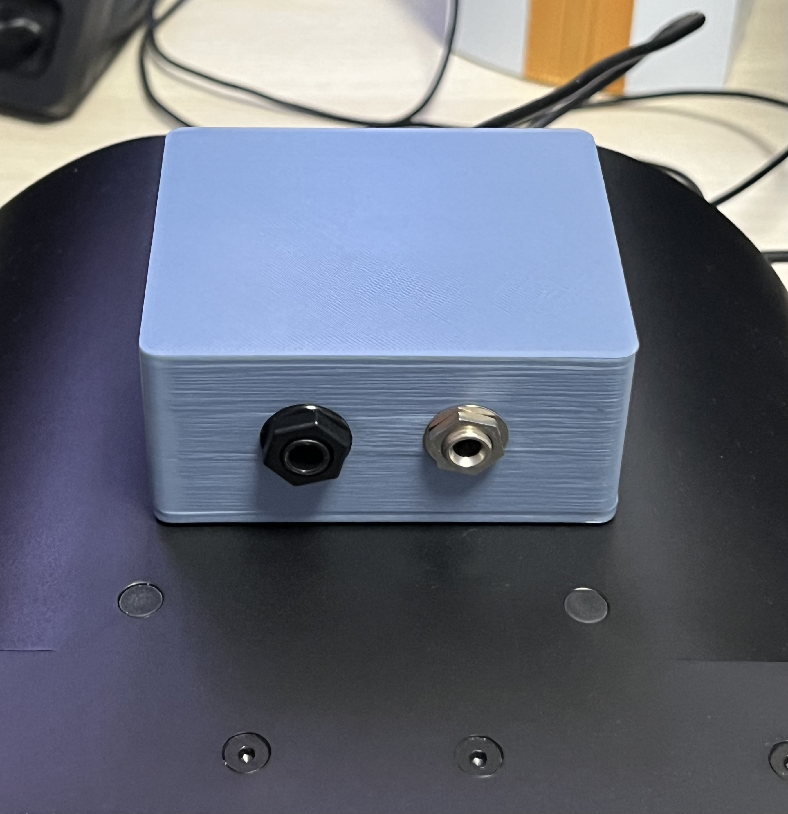

# GA Headset USB Adapter — V1

DIY-Adapter für ein GA-Headset mit zwei Klinkensteckern, beispielsweise ein **Lightspeed Zulu 4**, an einer USB-Soundkarte am PC oder Flugsimulator.

> **Nur PC-/Simulator-Nutzung. Kein zertifiziertes Aviation-Gerät. Nicht im Flugzeug verwenden und nicht an Flugzeug-Audio-, Funk- oder Intercom-Systeme anschließen.** Siehe [DISCLAIMER](DISCLAIMER.md).



## Stand dieser Veröffentlichung

Der Erbauer hat den V1-Prototyp gedruckt, montiert und erfolgreich am PC getestet. Nach Vergrößerung des Abstands zum Computer meldete er keine Störgeräusche und eine sehr gute Mikrofonaufnahme. Das ist ein Erfahrungsbericht zu einem Aufbau, keine messtechnische Freigabe oder allgemeine Kompatibilitätsgarantie.

**Dokumentationsstand für v1.0.0: zur abschließenden Prüfung.** Die originalen STL-Dateien und das Gerätefoto sind enthalten. Die ursprüngliche parametrische OpenSCAD-Datei konnte aus der Unterhaltung nicht wiederhergestellt werden; die beiliegende SCAD-Datei importiert die originalen STL-Netze. Der genaue C3-Wert, die beiden tatsächlich verbauten Mono-Mischwiderstände sowie die Modellbezeichnungen von USB-Soundkarte und Step-Up sind nicht belegt. Vor einem identischen Nachbau oder einem finalen Release bitte die [offenen Punkte](docs/verification.md) schließen.

## Funktionen

- USB-Soundkarte übernimmt Audioaufnahme und Kopfhörerausgabe.
- USB 5 V → Step-Up auf 12 V für den Mikrofon-Bias.
- RC-Versorgungsfilter: 22 Ω, 470 µF und 100 nF.
- 220-Ω-Bias-Widerstand zum Mikrofon-Ring.
- Mikrofon-Signal über Koppelkondensator C3 und 10 kΩ zum MIC-IN.
- Passives Zusammenführen von links und rechts über getrennte Widerstände auf Mono.
- 3D-gedrucktes Gehäuse mit Deckel, M3-Heat-Set-Inserts und offenem USB-Kabelschlitz.
- Kein analoger Sidetone, kein zusätzlicher Mikrofon-Preamp, kein Sidetone-Poti in V1.

Die USB-Mikrofonversorgung speist **nicht** die ANR-Elektronik des Headsets. Diese nutzt beim Dual-GA-Modell weiterhin die eigene Batterieversorgung. LEMO- und Helikopter-Stecker werden von dieser Version nicht unterstützt.

## Dokumentation und Dateien

| Inhalt | Datei |
|---|---|
| Stückliste mit Herkunft und offenen Werten | [BOM](hardware/BOM.md), [CSV](hardware/BOM.csv) |
| Elektrischer Schaltplan | [Schaltplan](hardware/schematic.md) |
| Anschluss für Anschluss | [Verdrahtung](docs/wiring.md) |
| Aufbau, Messungen und Inbetriebnahme | [Bauanleitung](docs/build.md) |
| Störungen und bekannte Grenzen | [Troubleshooting](docs/troubleshooting.md) |
| Gehäuse und Druck | [CAD](cad/README.md) |
| Quellen und belegter Projektstand | [Provenienz](docs/provenance.md) |
| Noch zu bestätigende Details | [Prüfliste](docs/verification.md) |
| Release Notes | [v1.0.0](releases/v1.0.0.md) |

## Prinzip

```text
PC ─ USB ─ Soundkarte ─ L/R ─ Widerstandsmischer ─ GA-Kopfhörer (Mono)
          │
          └ MIC-IN ← 10 kΩ ← C3 ← GA-Mikrofon-Ring
                                  ↑
USB 5 V ─ Step-Up 12 V ─ Filter ─ 220 Ω
Alle vorgesehenen Masseanschlüsse teilen GND.
```

## Unterstützung

Wenn dir das Projekt beim Einsatz deines Aviation-Headsets im Simulator hilft, kannst du die weitere Entwicklung freiwillig mit einem Kaffee unterstützen. Die Dateien bleiben frei verfügbar.

<a href="https://buymeacoffee.com/soso1999">
  
</a>

## Lizenz

Hardware-Dokumentation und CAD: **CERN-OHL-P-2.0**, vollständiger Text in [LICENSE](LICENSE). Allgemeine Texte und das Gerätefoto: **CC BY 4.0**, siehe [Lizenzzuordnung](LICENSES/README.md). Attribution: Josef Jankarashvili / GA Headset USB Adapter contributors. Lightspeed und Zulu sind Marken ihrer jeweiligen Inhaber; dieses Projekt ist unabhängig und nicht vom Hersteller unterstützt.

Die elektrischen Herstellerdaten wurden anhand der [offiziellen Zulu-4-Spezifikation](https://www.lightspeedaviation.com/product/zulu-4-anr-headset/) geprüft. Weitere Quellen stehen in der Provenienz-Dokumentation.
